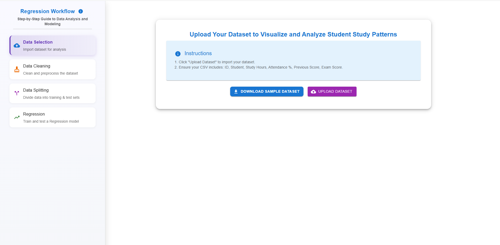
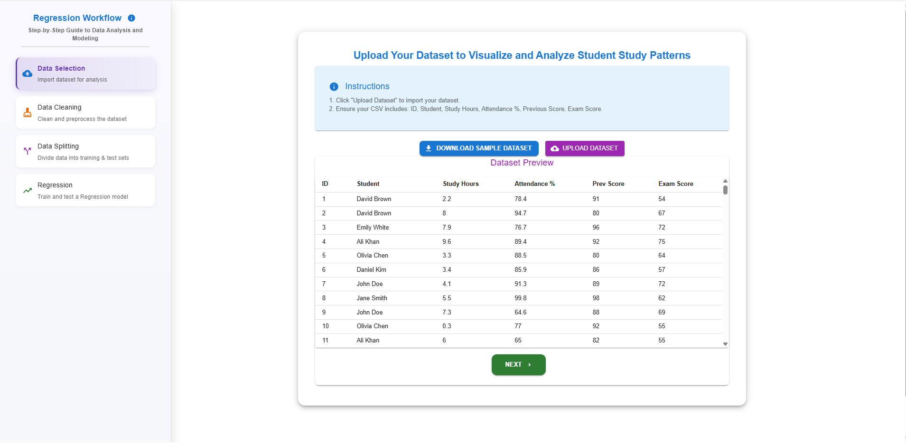
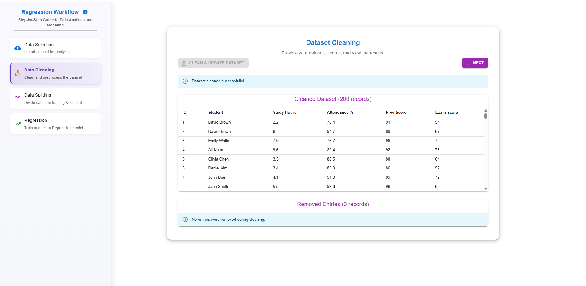
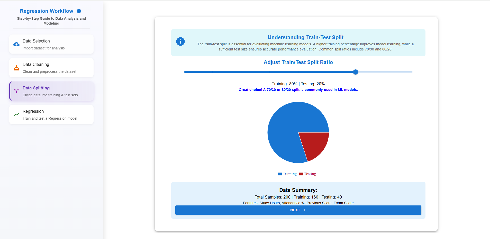
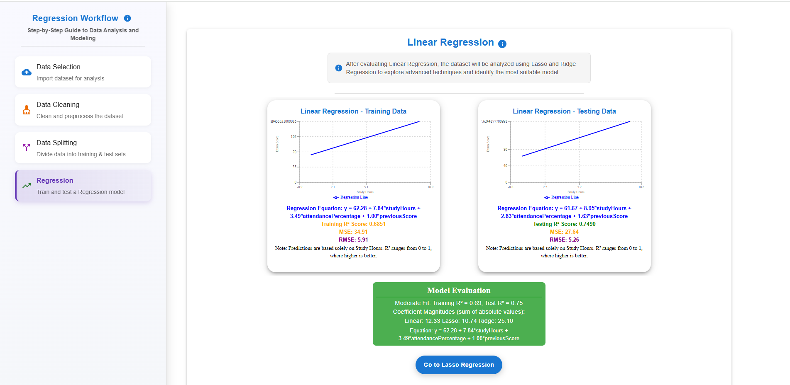
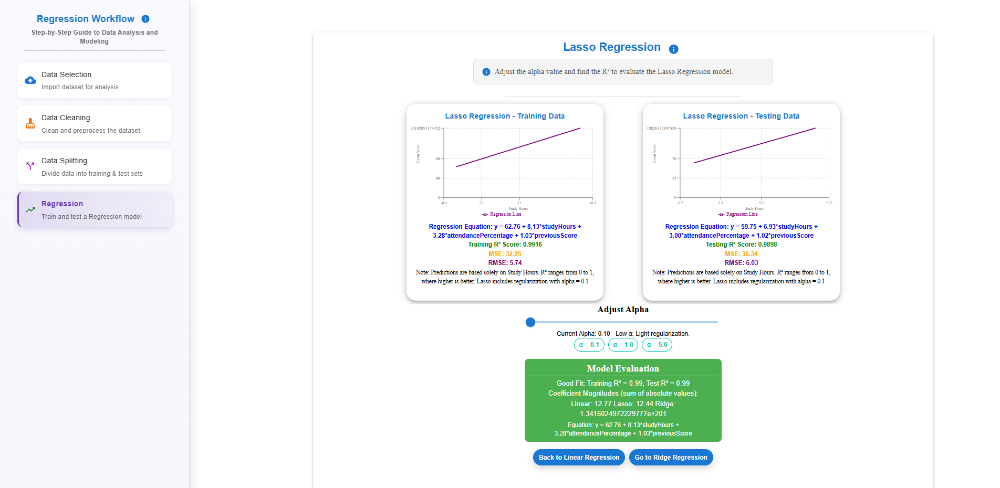
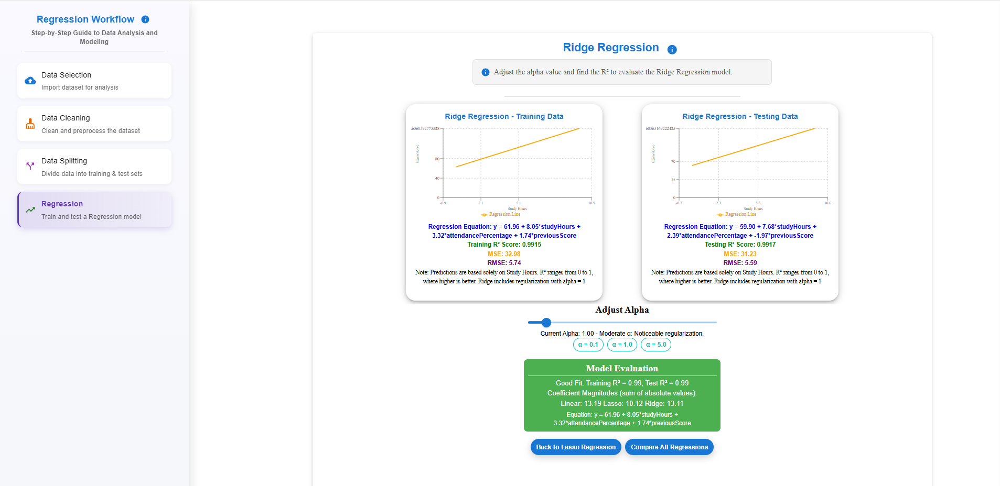
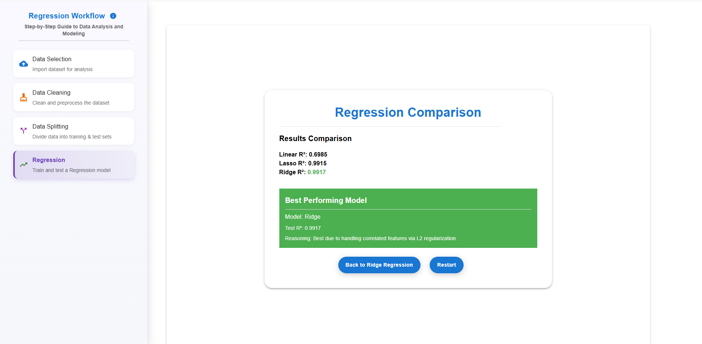

### Procedure

<strong>Step 1:</strong> Click on the <strong>"Upload Dataset"</strong> button, select the CSV file, and ensure it contains the columns: <strong>ID, Student Name, Study Hours, Attendance %, Previous Score,</strong> and <strong>Exam Score.</strong>

  

<strong>Step 2:</strong> Once the file is uploaded, a <strong>Dataset Preview</strong> will be displayed below the upload section. Click on the <strong>"NEXT"</strong> button to proceed to <strong>Data Cleaning.</strong>

  
 

<strong>Step 3:</strong> Click on the <strong>"Clean & Update Dataset"</strong> button to clean the dataset and view the <strong>Cleaned Dataset</strong>. Then, click on the <strong>"NEXT"</strong> button to proceed to <strong>Data Splitting.</strong>

 
 

<strong>Step 4:</strong> Adjust the slider to set the appropriate train-test split for the dataset. A common split is 80/20 for training and testing. After splitting, click on the <strong>"NEXT"</strong> button to apply <strong>Linear Regression</strong> to the data.

 

<strong>Step 5:</strong> Apply Linear Regression to the training and testing data to analyze the relationship between features and the target variable. Evaluate the R² values and, if there is a significant difference between training and testing R² scores, proceed to apply <strong>Lasso Regression</strong> for improved model performance.

 

<strong>Step 6:</strong> Apply Lasso Regression for improved model performance. Adjust the alpha value to find the best alpha and corresponding R² values. Compare the results to determine which model performs better. Click on "Go to Ridge Regression" to proceed and pass the data to <strong>Ridge Regression</strong> for further evaluation.

 

<strong>Step 7:</strong> Apply Ridge Regression and adjust the alpha value to find the best R² value. Click on "Compare All Regressions" to analyze and compare the results for selecting the most optimal model.

 

<strong>Step 8:</strong> Compare all regression models by analyzing their R² values and identify the best performing model. Highlight the most suitable regression based on the highest R² and performance on the dataset.

 